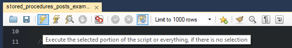

# (my)SQL Scripts

## About

_SQL Scripts_ is a set of scripts made **during my IT course**.  
All of the scripts were meant to be ron during test/non-final builds.

## Running

Before executing, be sure the script won't create an existing database or make unwanted changes to current DataBases or Tables.

### On MySQL Workbench

Insert the script into a blank or active file.



### Linux Terminal

**sudo** can be replaced by **doas** or any other form of root access (if needed).

> Tested on ArchLinux only!

Activating service:

```sh
sudo systemctl start mariadb.service
```

Running:

```sh
sudo -Es mariadb < {FILENAME}.sql
```

## Tools used

| Tool                                                            | Description                 |
| --------------------------------------------------------------: | :-------------------------- |
| [MySQL Workbench](https://www.mysql.com/products/workbench/)    | Windows MySQL development   |
| [XAMPP](https://www.apachefriends.org/)                         | Windows MySQL service       |
| [MariaDB (ArchLinux)](https://wiki.archlinux.org/title/MariaDB) | ArchLinux MySQL alternative |
| [NeoVim](https://neovim.io/)                                    | Text editor                 |

---

## License

This project uses the [The Unlicensed license](LICENSE) since the scripts won't be utilized during real development (for myself, at least).  

## Disclaimer

If you use **one or more of my scripts entirely or partially** and something goes horribly wrong, _don't hold me responsible_. I am still a student in **DB**.  
No, the logo in the title is not mine; it belongs to MySQL.
